# Understandability

## Survey

***A. Setup For User Survey***

  The setup of our user survey for RQ1 is as follows.
1) *Survey Participants:* Our target participants include developers of Java decompilers, developers of popular Java open-source projects and academic researchers. Developers of decompilers possess specialized knowledge and experience in decompilation techniques, providing valuable insights into tool development and usage. Engaging with developers of open-source projects allows us to capture the perspectives of potential end users of Java decompilers in real-world software development scenarios. In detail, 234 developers from 8 well-known Java decompiler projects on GitHub, 451 developers from 10 popular Java projects, and 120 researchers majored in computer science from 3 world-famous universities have been selected as our target participants. Eventually, 805 developers and researchers were invited to participate in this user survey in total.
2) *Survey Platform:* E-mails, which were sourced from publicly accessible websites, have been employed to gather questionnaire responses from participants across different regions and backgrounds, during which anonymity is ensured.
3) *Survey Questions:* A total of 11 questions have been designed in the questionnaire. The first question (Q1) examines whether participants have prior experience with decompilers, while the remaining questions are categorized into three distinct groups: (1) the participants’ self-evaluation, including their education level (Q2), their experience in Java programming (Q3); experience in Java decompilers usage, including the Java decompilers ever used (Q4), the purpose they used the decompilers for (Q5) and the frequency of using decompilers (Q6); (2) the importance of Java decompilation (Q7), decompilation correctness (Q8), and decompilation understandability in the participants' view (Q9); (3) the frequency of decompilation failures (Q10) and understandability issues (Q11) encountered by participants.

  <figure>
	  <figcaption style="text-align: center;"><strong>Table I: Survey Questions. </strong></figcaption>
    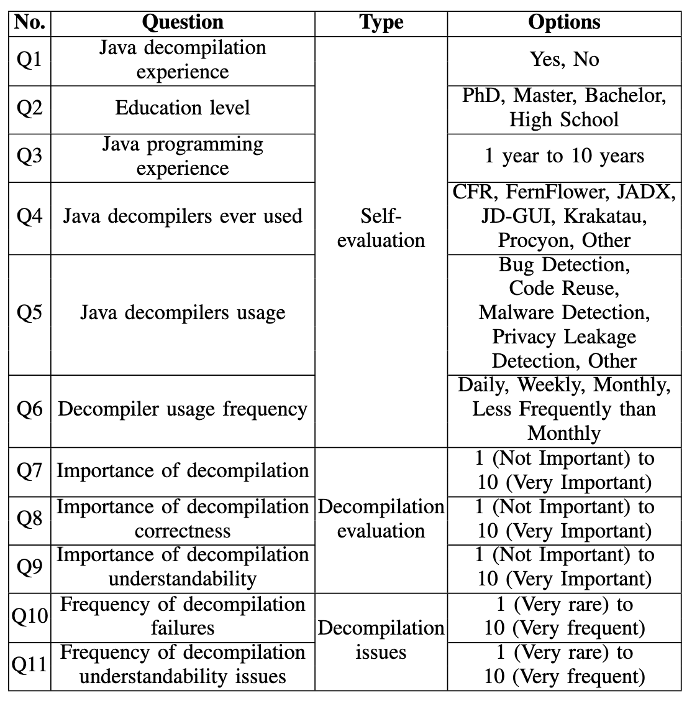
  </figure>

  To note, we focus not only on the decompilation understandability but also on the decompilation correctness in the design of this survey, as correctness is another important concern in decompilation. It can help us have a better comprehension of the importance of decompilation understandability and frequency of understandability issues in comparison. Particularly, question Q1 is designed to help us exclude invalid responses from users who have never used Java decompilers. Questions Q7-Q11 are 10-point Likert scale questions with 10 selections ranging from 1 (not important/very rare) to 10 (very important/very frequent).

  <figure>
    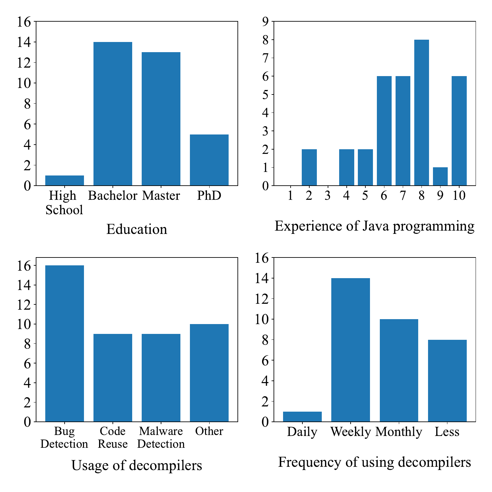
    <figcaption style="text-align: center;">(a) Respondents' self-evaluation and Java decompiler experience. </figcaption>
  </figure>

  <figure>
    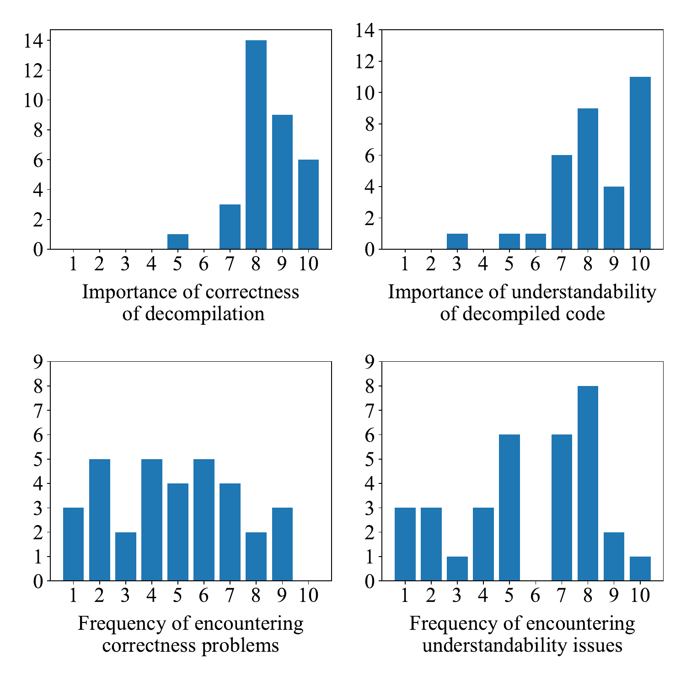
    <figcaption style="text-align: center;">(b) Respondents' evaluation on the correctness and understandability of Java decompilation. </figcaption>
  </figure>

  <figure>
    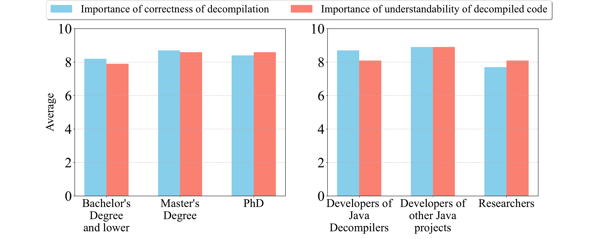
    <figcaption style="text-align: center;">(c) Respondents' evaluation on the importance of correctness and understandability in terms of their education levels and roles. </figcaption>
  </figure>

  
<strong>Figure 1: Survey results.</strong>

***B. Survey Results***

  Eventually, we received 33 valid survey responses, out of which 15 were from developers of Java decompilers, 9 were from developers of other Java projects, and 9 were from university researchers. Figure 1a presents the respondents' self-evaluation and their usage experience with Java decompilers. Among all 33 respondents, 97% (32 out of 33) hold at least a bachelor degree, with over half holding a master's degree or a PhD degree. In addition, 82% respondents (27 of 33) have more than five years of experience in Java programming. These facts indicate that the survey sample consists of respondents with advanced degrees and rich experience in Java programming. These respondents are likely to have a deeper understanding of Java programming and be encountered with a wider diversity of coding styles and practices. Hence, these respondents are better equipped to evaluate the correctness and the understandability of Java code, especially the decompiled code, making their responses more reliable.

  Fernflower, JD-GUI, Jadx and CFR,  are four of the most frequently used decompilers, and over 88% of respondents have used any one of the four decompilers. The purposes for using Java decompilers are quite diverse: the three most common motivations are bug detection (16 respondents), code reuse (9 respondents), and malware detection (9 respondents). Additionally, several other uses were reported, including privacy leakage detection (3 respondents), source code viewing (3 respondents), study (2 respondents), library logic understanding (1 respondent), and tool refinement (1 respondent). Regarding the usage experience of Java decompilers, 76% respondents use decompilers no less frequently than monthly, suggesting that most respondents are well-acquainted with Java decompilers, which in turn implies that their evaluations of these Java decompilers are likely to be relatively objective. 

  Figure 1b further illustrates the distribution of respondents' evaluation on the correctness and understandability of Java decompilation, in which 24% of respondents think that Java decompilation is extremely important (score 10), with an average score of 7.7. In detail, 97% of respondents assigned a score over 5 to the importance of decompilation correctness, while the corresponding figure for the importance of decompilation understandability is 94%. Their average scores are 8.5 and 8.3, respectively. Although 6% (2 out of 33) of respondents rated the importance of decompilation understandability below 5.5 (the midpoint), 33% (11 out of 33) considered it very important (score 10), a proportion even higher than that for decompilation correctness. These statistics suggest that developers and researchers in the wild regard decompilation understandability as important as its correctness.

  Similar trends have also been observed in the frequency of decompilation failures and understandability issues encountered by respondents. The average scores for the frequency of encountered decompilation failures and decompilation understandability issues are 4.8 and 5.7, indicating that understandability issues are more commonly encountered in daily Java decompiler usage. A detailed investigation reveals polarized opinions on the frequency of understandability issues: though 30% respondents (10 out of 33) rated the frequency of understandability issues as low (score 4 or lower), 52% regraded them as frequent (score 7 or higher), and 24% assigned a high score of 8, the most frequently-selected score among all options. While it is possible that a number of understandability issues arise from the inherent complexity of the source code, our empirical findings addressing RQ2 (further demonstrated in **Subsection  Experimental Results**) indicate that a significant proportion of these issues are caused by their own implementation.

  In addition, an interesting finding can be found in the importance of correctness of decompilation and understandability of decompiled code in terms of the education level and identity of the respondents. As depicted in Figure 1c, respondents with a master's degree or lower tend to prioritize correctness slightly more than understandability, whereas PhD holders place marginally greater importance on understandability over correctness. In terms of the roles of respondents, developers of Java decompilers  exhibit a slight preference for correctness over understandability, while developers of other Java projects view correctness and understandability as nearly equally important. In contrast, researchers tend to prioritize understandability, albeit marginally, over correctness. These findings suggest that for researchers, as well as those highly educated, attach more slight importance to decompilation understandability than correctness. Nevertheless, almost all respondents across various kinds of education levels and roles consistently regard both decompilation understandability and correctness as important attributes.

  While decompilation correctness has been widely studied, the understandability of decompilation, especially Java decompilation, remains unexplored. Our work aims to fill this gap by conducting the first comprehensive study on Java decompilation understandability. We investigate the typical causes of understandability issues, explore the potential for developing metrics to effectively assess understandability, and pave the way for future research in this area.

**CONCLUSION:** Java program developers and researchers in the wild regard the understandability of Java decompilation as important as its correctness, and decompilation understandability issues are even more commonly encountered than decompilation failures.

## Experimental Results

***A. RQ2: how can code understandability vary between decompiled code and source code?***

  <figure>
	  <figcaption style="text-align: center;"><strong>Table II: Details of the relative understandability of the annotated dataset (Each cell denoted as a/b/c presents that under the specific Java project and decompiler, there are a, b and c decompiled files demonstrating Less Equi and More understandability relative to their respective source code). </strong></figcaption>
    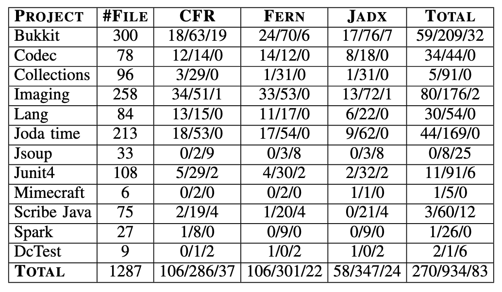
  </figure>

The annotated result of 1287 files is presented in Table II by Java projects and decompilers.

Evidently, a predominant 93.6% ((934+270)/1287) of the decompiled files, are annotated as either ***Equi*** or ***Less*** understandable in comparison to their original source code files. This observation is consistent with logical expectations, given that decompiled files share identical semantics (bytecode) with their corresponding source code, where the semantics greatly influence the understandability of both the decompiled and source code. However, it is important to note that the source code is typically maintained and optimized with human-intelligence, and naturally should have higher readability and understandability than code automatically generated by Java decompilers. This may explain the observed 21.0% decompiled files exhibiting ***Less*** understandability. 

  <figure>
    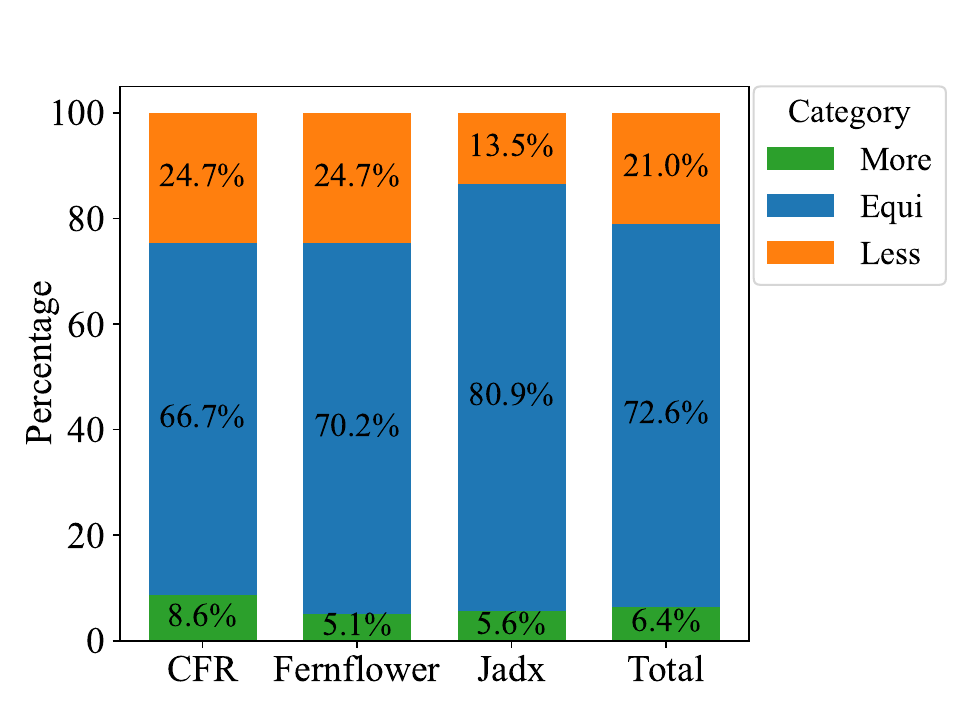
    <figcaption style="text-align: center;"><strong>Figure 2: An overview of relative understandability of the decompiled files when compared to corresponding original ones. </strong></figcaption>
  </figure>

While this proportion may be relatively modest, such cases of ***Less*** can be commonly observed in eleven out of all twelve Java projects (the exception is project Jsoup containing only 33 files) and the percentage of all three decompilers as shown in Figure 2. This observation indicates that, despite decompilers' ability to generate code that is syntactically and semantically accurate, a noteworthy subset of the decompiled code manifests a higher complexity than that of the source code, which, however, may impede the intended objective of program comprehension in decompilation.

  <figure>
    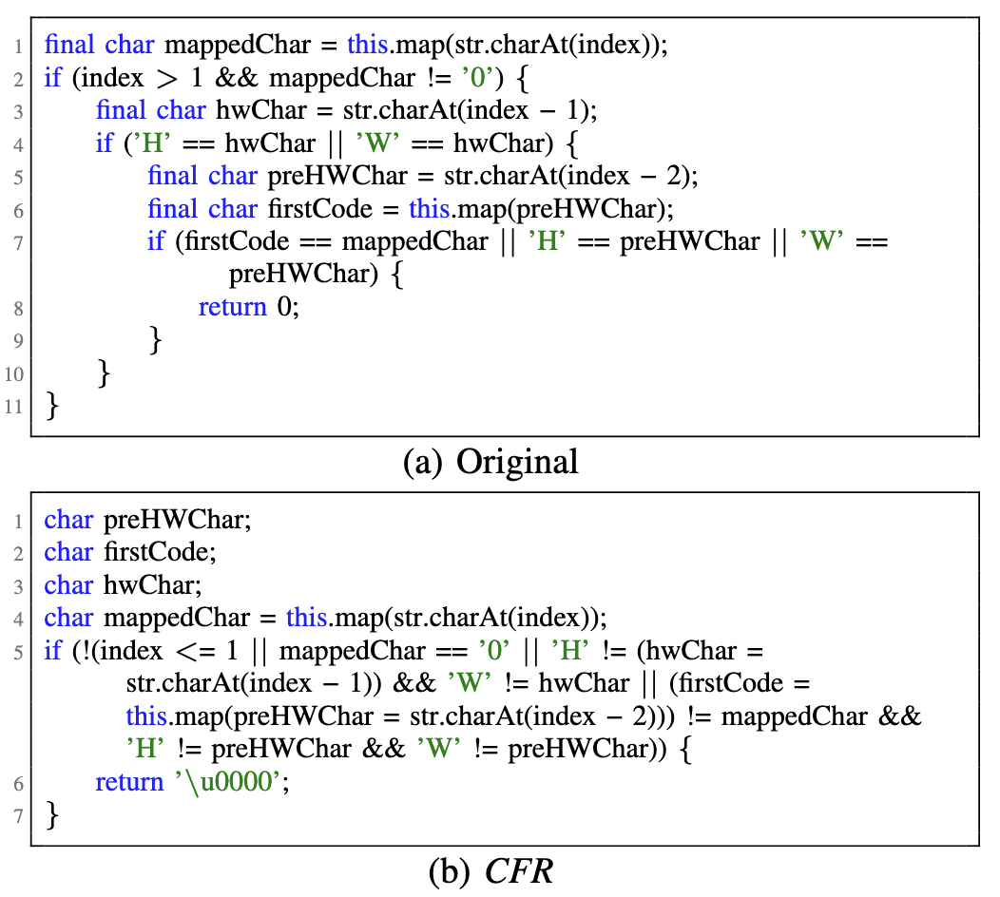
    <figcaption style="text-align: center;"><strong>Figure 3: Excerpts of org.apache.commons.codec.language.Soundex, original and decompiled by CFR. </strong></figcaption>
  </figure>

A typical example shown in Figure 3 further illustrate the understandability challenges introduced due to Java decompilation. As shown in Figure 3a, the original code is organized with clear variable declarations and well-structured nested logic, processing each character of the string sequentially and mapping it accordingly. Whenever certain conditions involving the characters "H" or "W" in relation to their neighboring characters are met, the code returns 0. In contrast, the corresponding decompiled code generated by CFR in Figure 3b suffers from a lack of logical organization. Variable assignments including "preHWChar", "firstCode" and "hwChar" are unnecessarily inlined into the conditional expression, breaking the natural flow of the code. Moreover, the decompiled version introduces complex conditional statements, concatenating multiple comparisons and operations into a single expression. This not only increases the cognitive load but also complicates the process of understanding the logic.

Such examples highlight the inherent challenges associated with producing well-structured and human-readable code through decompilation: during compilation, the original structures of the source code and the user intent embedded within them are often lost, therefore both the code snippets in Figure 3a and Figure 3b may exhibit identical representations in Java bytecode. Unfortunately, current Java decompilers typically fail to recover these original structures, revealing significant opportunities for improvement in the code generation strategies employed by Java decompilers.

For the remaining 6.4% decompiled files, they are identified to have higher understandability relative to their original source code files. This data implies the potential of Java decompilers to generate code snippets that exhibit superior structural coherence and understandability, even in comparison to source code written by developers. 

**CONCLUSION:** A noteworthy proportion of code snippets decompiled by current Java decompilers exhibits significant lower or even higher understandability relative to their respective source code.

***B. RQ3: how can rule-based understandability metrics assess the understandability of both decompiled code and their corresponding source code?***

  <figure>
    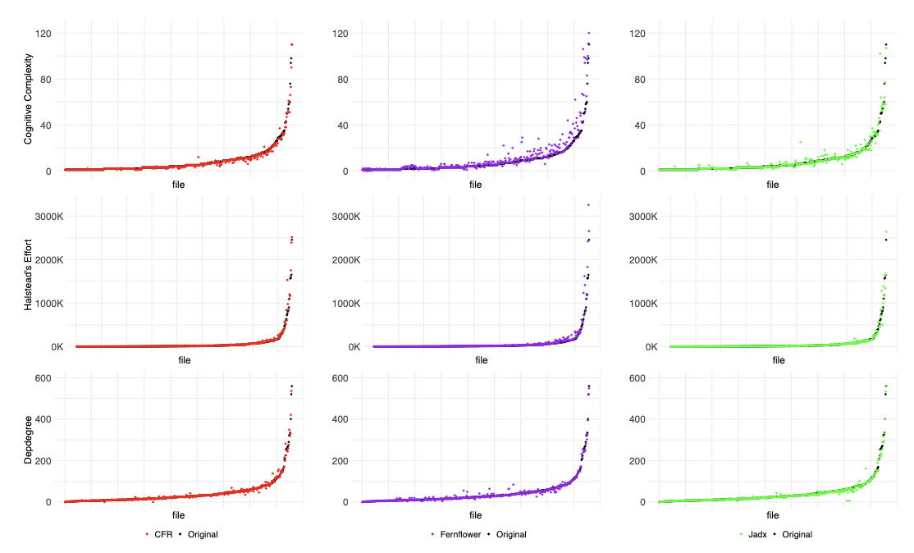
    <figcaption style="text-align: center;"><strong>Figure 4: Scatter plots of Cognitive Complexity (1st row), Halstead's Effort (2nd row), and Depdegree (3rd row) scores of original files and corresponding decompiled files.</strong></figcaption>
  </figure>

To answer RQ3, Figure 4 presents all three rule-based metrics' scores of the original files and corresponding decompiled files with an outlier removed. In the first row of Figure 4, files are organized in ascending order based on their respective Cognitive Complexity of original files. The only outlier pertains to a source file in the project Lang, whose Cognitive Complexity is 138. The associated decompiled code, generated by CFR, Fernflower, and Jadx, manifests Cognitive Complexity scores of 150, 197, and 177, respectively.

The Cognitive Complexity scores for the remaining source files exhibit a spectrum ranging from 1 to 110, with an average value of 8.5. With decompiler CFR, Fernflower, and Jadx, the scores of respective decompiled files range from 1 to 110, 0 to 120, and 1 to 107, yielding an average of 8.0, 11.0, and 8.6.

For Halstead's Effort, an outlier from Imaging with a value of 525.2K is excluded. The corresponding decompiled code, generated by CFR, Fernflower, and Jadx, yields scores of 468.9K, 479.3K, and 481.9K, respectively. For the remaining source files, scores range from 242 to 2453.9K, with an average value of 70.5K. 
The scores of decompiled files produced by CFR, Fernflower, and Jadx range from 186 to 2516.8K, 128 to 3258.0K, and 186 to 2642.6K, with averages of 77.8K, 89.3K, and 71.7K, respectively.

For Depdegree, the source file scores range from 0 to 560, with an average of 42.8. The scores for decompiled files generated by CFR, Fernflower, and Jadx span ranges of 0–602, 0–549, and 0–557, with corresponding averages of 43.1, 42.4, and 41.6.

The analysis of the figures reveals two notable observations. First, the decompiled code produced by CFR, Fernflower, and Jadx exhibits significantly divergent average scores across the three distinct understandability metrics. This discrepancy may be attributed to the fact that the three metrics yield substantially different relative understandability assessments for a considerable number of identical pairs of decompiled and source code files.
Second, the distribution of decompiled code across the three decompilers demonstrates greater alignment with the source code under Halstead's Effort and Depdegree compared to Cognitive Complexity, suggesting that these two metrics are less sensitive to variations in understandability induced by Java decompilation than Cognitive Complexity.

Notably, the Cognitive Complexity for files generated by CFR and Jadx closely resemble those of the original files. In contrast, files produced by Fernflower exhibit a significant increase when compared to their original counterparts because Fernflower tends to generate explicit $else$ statements and braces, resulting in more nested code structures and higher scores. 
While two out of the three Java decompilers turn out to generate code with Cognitive Complexity levels comparable to that of the source code, whether these code pieces exhibit similar levels of understandability warrants further exploration.
Therefore, we compute the confusion matrix of the relative understandability indicated by Cognitive Complexity with reference to the annotated dataset. In order to convert Cognitive Complexity into three categories of relative understandability, we consider files with similar Cognitive Complexity scores to the original equivalently understandable. 
Specifically, we employ the following formula:

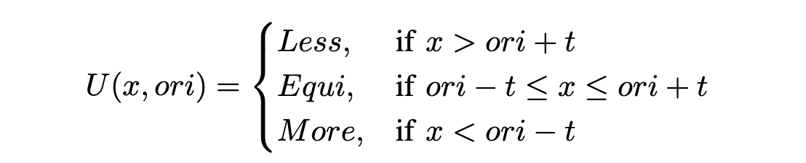

Here $x$ and $ori$ represents the Cognitive Complexity score of the decompiled and the original file, respectively, where $t$ represents the threshold denoting the maximum allowable disparity between the decompiled and original file. For the value of $t$, we tried integer values ranging from 0 to 10 to optimize the overall performance.
Given the imbalanced nature of the dataset, we choose to maximize the macro F1-score, which is the mean of F1-scores of all classes. 
Through experiments, $t$ is empirically set to 3 since setting $t$ to 3 resulted in a local optimal macro F1 score of 0.47. Notably, the macro F1 score decreased both when $t$ was reduced from 3 to lower and when it was increased from 3 to higher. Given that our study aims to assess the general effectiveness of existing understandability metrics in distinguishing the understandability differences between source and decompiled code, setting $t$ to 3 maximizes the general effectiveness of Cognitive Complexity, thereby better aligning with the goal of our study.

  <figure>
    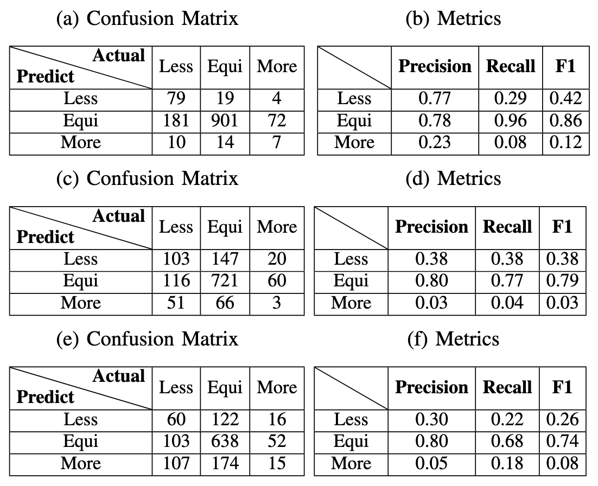
    <figcaption style="text-align: center;"><strong>Table III: Confusion Matrix and metrics of relative understandability indicated by Cognitive Complexity((a) and (b)),  Halstead's Effort ((c) and (d)), and Depdegree ((e) and (f)).</strong></figcaption>
  </figure>

In order to comprehensively evaluate this metric, we proceed to compute the precision, recall, and F1-scores for each category.
The confusion matrix along with pertinent metrics are displayed in Table III. Although the F1-score of the ***Equi*** is relatively high (0.86), F1-scores of ***Less*** and ***More*** are 0.42 and 0.12 respectively, yielding a macro F1-score of 0.47. 

As shown in Table III, 27.4% (353/1287) of files exhibit a significantly enhanced or diminished level of understandability after decompilation. Nevertheless, these occurrences assume considerable significance, as they imply possible failure in the designing of heuristic algorithms of decompilation for selecting appropriate syntactic representations for the identical semantics. Specifically, Cognitive Complexity only achieves a recall of 0.29 for ***Less*** understandable decompiled files. Stated differently, Cognitive Complexity exhibited the capability to identify merely 79 instances among the total 270 files of this category, concurrently mistook 181 of the remaining 191 files as ***Equi***. 
The utilization of Cognitive Complexity in the evaluation of decompilation understandability, if possible, may introduce the potential for developers to inadvertently overlook these 191 files. This oversight warrants serious consideration, as these files may harbor indications of failure designs contributing to the increased complexities in the decompiled code.

Despite the low recall of Cognitive Complexity in recognizing ***Less*** and ***More*** understandable files, Cognitive Complexity achieves a precision of 0.77 in recognizing ***Less*** understandable files. This fact shows the potential of Cognitive Complexity as a measure of decompiled code understandability. Our further investigation into these correctly recognized ***Less*** understandability decompiled files reveals that 81.4% of these files contains more intricate nested code structures than the original counterparts.
However, it is also not always the case.
There also exists some nested code structures whose understandability can not be precisely assessed with Cognitive Complexity, as exampled in Figure 5. This figure shows a decompilation by Fernflower of a code snippet from the Bukkit project. In this decompilation, the nested $if$ statements "condition2" and "condition3" are placed within the $if$ statement "condition1", increasing the block depth and thereby complicating understandability. While this discrepancy in understandability is reflected in the Cognitive Complexity scores—5 for the original source and 8 for the decompiled code—the difference remains within our threshold (set to 3). Eventually, this instance results in a misclassification from ***Less*** to ***Equi***. 

These observations underscore the effectiveness of Cognitive Complexity in capturing the complexity of the control flow. However, when it comes to some nested conditional or loop structures, Cognitive Complexity fails to accurately reflect the precise impact of these structures on code understandability in decompilation.

  <figure>
    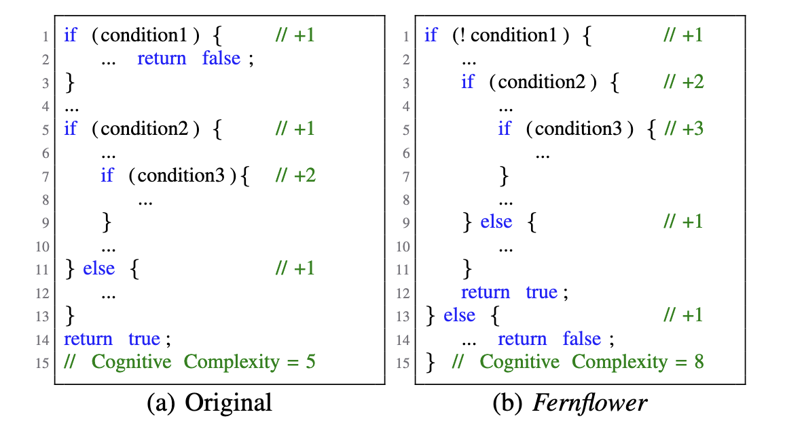
    <figcaption style="text-align: center;"><strong>Figure 5: Cognitive Complexity scores for original org.bukkit.command.defaults.KickCommand and corresponding code generated by Fernflower.</strong></figcaption>
  </figure>

The evaluation on the effectiveness of Halstead's Effort and Depdegree in predicting relative understandability were conducted based on the calculating tools provided in previous studies[1][2]. Following a similar approach to Cognitive Complexity, we transformed their metric values into relative understandability with thresholds $t=3294$ and $t=1$ that yield highest macro F1-score, respectively. To note, even when $t$ is set to 1 for Depdegree, the data-flow complexity assessed by Depdegree between decompiled and source code aligns closely, as indicated in Figure 4. 
Then we calculated the confusion matrix as well as metrics such as precision, recall, and F1-score indicated by two complexity metrics. As shown in Table III, macro F1-scores are 0.40 and 0.36, respectively. Similar to Cognitive Complexity, the F1-scores of the ***Equi*** are relatively high, 0.79 and 0.74, respectively. While the F1-scores of ***Less*** and ***More*** are notably low. This disparity highlights these two metrics' limitations in distinguishing between decompiled code with lower or higher understandability, suggesting the requirement for further refinement of these metrics or additional features to improve prediction accuracy, especially for the ***Less*** and ***More*** categories. It's also worth noting that the F1-scores across all categories under these two metrics are consistently lower than the corresponding values of Cognitive Complexity.

**CONCLUSION:** Cognitive Complexity demonstrates relatively acceptable precision while low recall in recognizing decompiled code snippets exhibiting diverse understandability relative to their respective source code, whereas Halstead's Effort and Depdegree demonstrate both low precision and recall.

***C. RQ4: how can language-model-based metrics assess the understandability of both decompiled code and their corresponding source code?***

  <figure>
    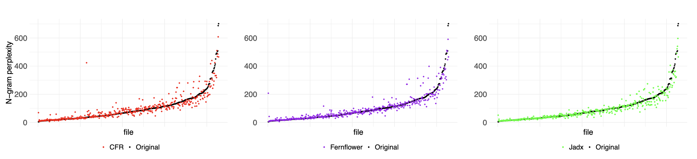
    <figcaption style="text-align: center;"><strong>Figure 6: Scatter plots of n-gram Perplexity scores of original files and corresponding decompiled files.</strong></figcaption>
  </figure>

To address RQ4, Figure 6 presents Perplexity scores of decompiled files and their corresponding original files with an outlier removed, as well. The only outlier is observed in a source file from the project Imaging, characterized by an original Perplexity of 3218.9. The perplexities of its corresponding decompiled code, generated by CFR, Fernflower, and Jadx, manifest as 3134.0, 3153.7, and 4502.6, respectively.
Except this outlier, the Perplexity metrics for the remaining source files span a broad spectrum, ranging from 3.7 to 701.5, with an average value of 99.1. With decompiler CFR, Fernflower, and Jadx, the Perplexity of respective decompiled files falls within the range of 5.6 to 608.1, 5.6 to 590.5, and 7.6 to 596.7, resulting in average values of 101.0, 100.2, and 94.5.

It's noteworthy that no significant increases or decreases are observed between scores of original files and files generated by different decompilers. To evaluate Perplexity, we compute the confusion matrix and relative metrics of the relative understandability indicated by Perplexity with reference to the annotated dataset. We adopt a dynamic approach that utilizes a ratio, rather than a fixed value, to determine the bounds of equivalent understandability.
It is because the use of ratios rather than fixed values for the threshold of Perplexity is intended to normalize the measurement, allowing for a more consistent comparison across different code snippets.
The Perplexity scores of files with higher values would undergo much more significant changes in the decompiled output compared to files with lower values, even when similar changes occur. As indicated in Figure 6, the greater the perplexity of the original file is, the greater the change between the original file and the decompiled file may be.
Specifically, we employ the following formula:

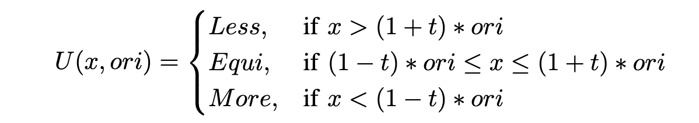

where $x$ represents the Perplexity score of the decompiled code, $ori$ represents the Perplexity score of the original. 

We determine a ratio of 0.27 as our selected threshold, which yielding a highest macro F1-score of 0.40.

  <figure>
    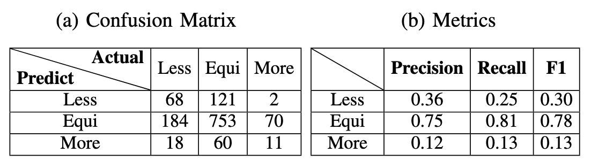
    <figcaption style="text-align: center;"><strong>Table IV: Confusion Matrix and metrics of relative understandability indicated by Perplexity.</strong></figcaption>
  </figure>

The results are shown in Table IV. Perplexity exhibits several phenomenons similar to that of Cognitive Complexity, albeit more serious. The F1-scores for ***Less*** and ***More*** understandable decompiled files are 0.30 and 0.13 respectively. Specifically, Perplexity only achieves a precision of 0.36 and a recall of 0.25 for ***Less*** understandable decompiled files, and the macro F1-score is only 0.40, which suggests that Perplexity may not be well-aligned with the code understandability of decompilation.

These figures reveal that Perplexity is difficult to capture the unnaturalness of the code, suggesting that it may require further refinement or be more effective in identifying certain types of unnatural code patterns. This finding underscores the complexity of assessing code understandability and highlights the challenges in automating this process effectively.

**CONCLUSION:** Perplexity demonstrates both low precision and recall in recognizing decompiled code snippets exhibiting diverse understandability relative to their respective source code.

## References

[1] N. Peitek, S. Apel, C. Parnin, A. Brechmann, and J. Siegmund, “Program comprehension and code complexity metrics: An fmri study,” in 43rd IEEE/ACM International Conference on Software Engineering, ICSE 2021, Madrid, Spain, 22-30 May 2021, pp. 524–536, IEEE, 2021.

[2] D. Beyer and A. Fararooy, “Depdigger: A tool for detecting complex low-level dependencies,” in 2010 IEEE 18th International Conference on Program Comprehension, pp. 40–41, 2010.